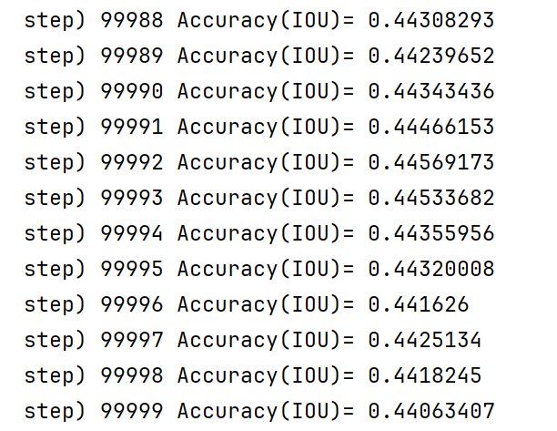
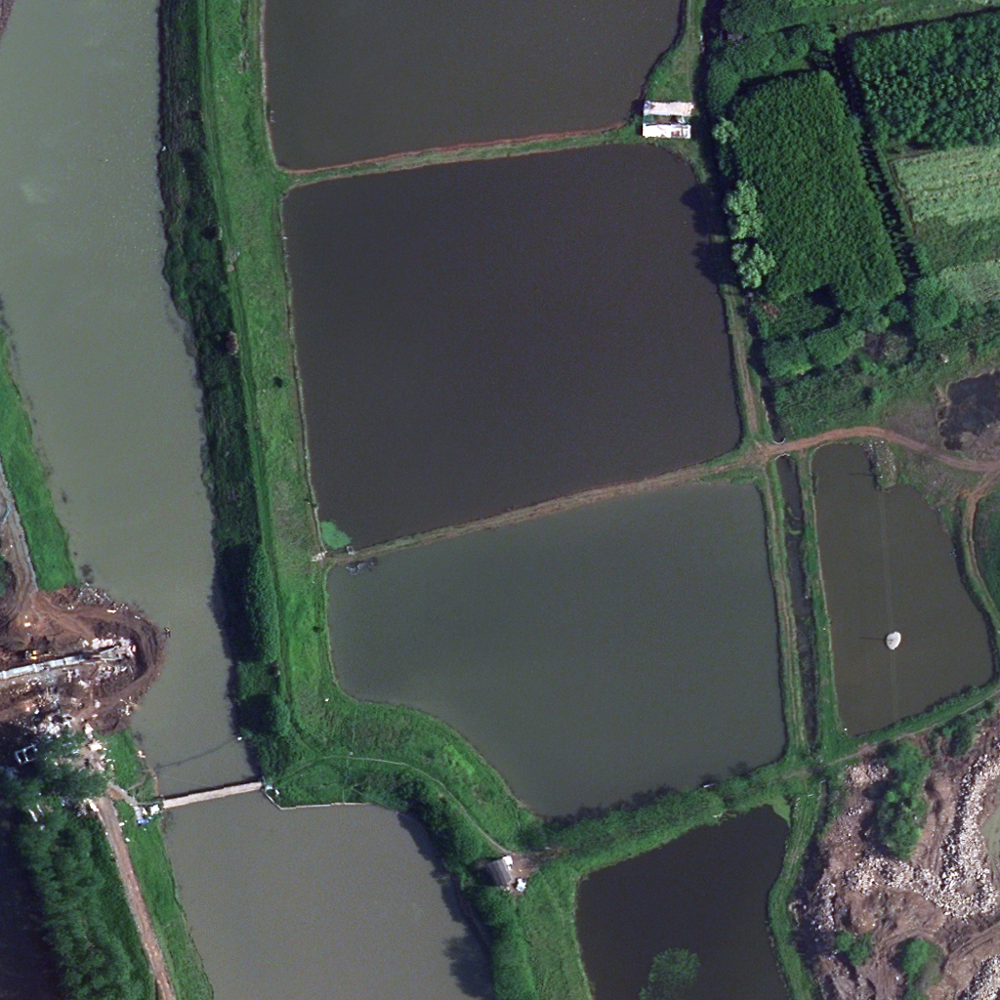
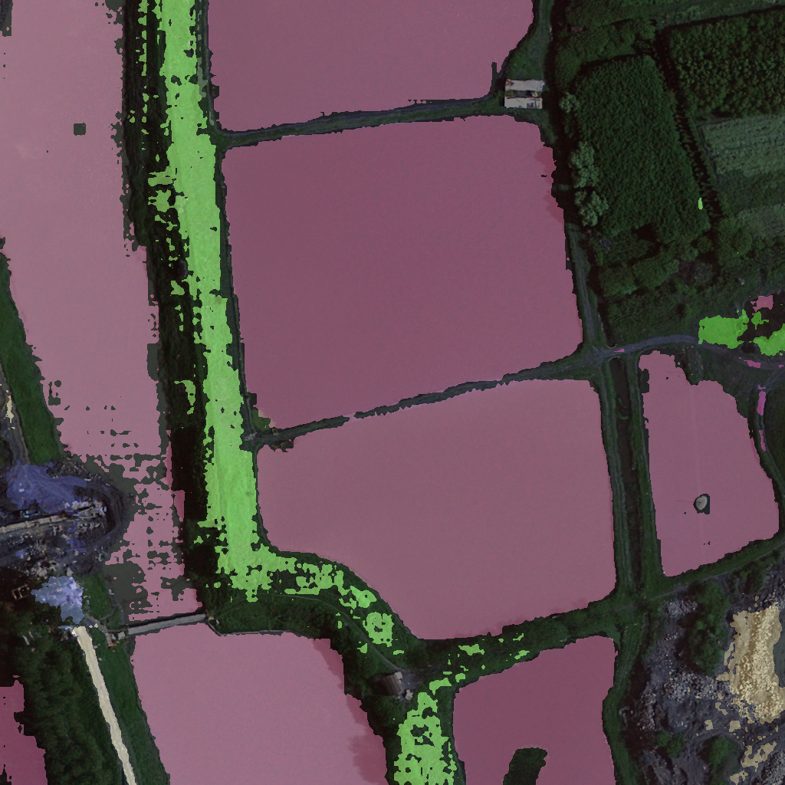
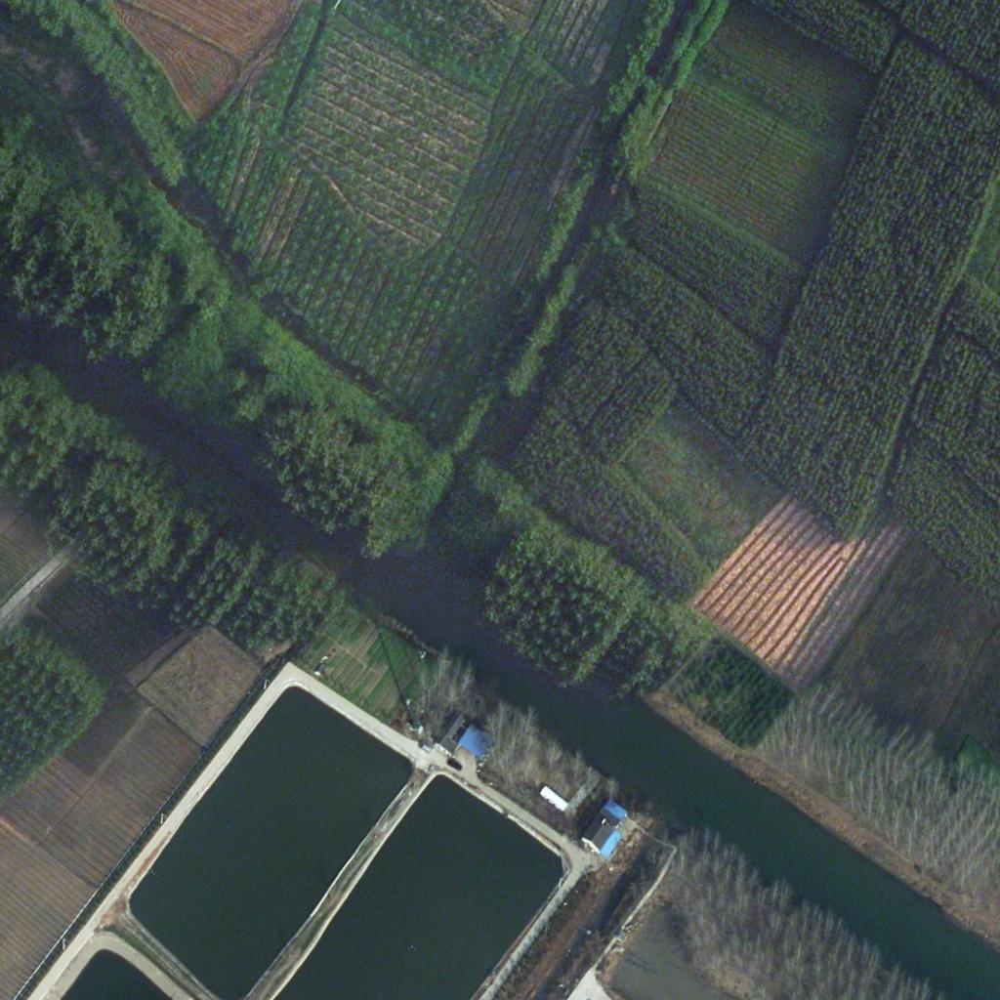
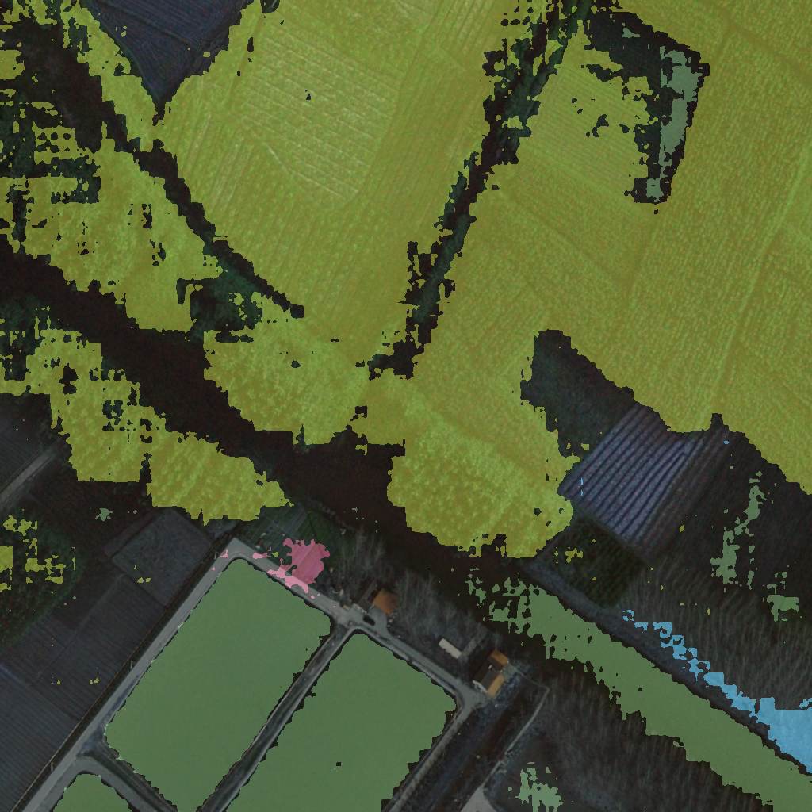

## 2022202799 王嘉艺
# 题目选择
---

- 题目：遥感图像土地利用分类
- 题目意义：遥感图像是通过遥感技术，如卫星、无人机等获取的地球表面影像数据。与普通照片不同，遥感图像不仅可以捕捉可见光，还可以捕捉到不可见的光谱，如红外、紫外等，从而提供更丰富的地物信息。遥感图像通常具有高分辨率的特征，能够覆盖广阔的地表区域，极大地扩展了对土地利用状况的监测能力。而我国幅员辽阔，地形多样，如果能够有效利用遥感图像，能够通过遥感进行环境监测、城市规划、农作物识别与监测等，为提升公共建设、保护环境提供优化方案，从而提高土地利用效率。

# 研究方法
---

- 常见的语义分割实现方法有FCN、U-Net以及DeepLab系列模型，这些经典模型为之后的方法提供了主要研究思路
- 2023年4月5日，Meta提出了segment anything模型，能够在给出点、边界框或文字提示下进行交互，分割出图形而不局限于特定的类别，学界戏称其为“分割一切的大模型”。2024年9月，Meta又提出了segment anything2，使用1100万张图像和110亿个掩码进行训练，称在速度方面进行了优化，并且能够对视频进行分割。
- segment anything2在预训练后已经具备了良好的分割能力，但是在特定的领域上，精准度依然有待提高。我将使用武汉大学发布的EarthVQA数据集，对segment anything模型进行微调，以实现其在遥感图像语义分割方面更好的表现。
- EarthVQA数据集共有5987个图像样本，7个土地覆盖类别，166768个标签

# 实现过程
---

- 在进行必要的环境配置后，加载数据集
- 首先对掩码解码器和提示编码器对大型模型进行训练，使用AdamW优化器和混合精度训练提高效率
- 使用交叉熵损失计算预测掩码和真实掩码之间的误差
- 同时使用交并比预测掩码的得分
- 通过梯度下降法优化模型参数，训练100000步，每1000步保存一次模型

- 训练之后的模型并不理想，于是换用小型模型，之后又对图像编码器也重新进行了训练，模型有所优化

# 模型效果
---

- 最终平均交并比为0.4406

- 以下为测试集上效果

- 以下为训练集上效果

# 改进方向
---

- 数据集标注
	- 如果数据集中的标注不准确，模型在学习过程中可能会学习到不准确的模式。对于系统性错误，深度学习算法并不健壮，这可能导致算法学习到错误的关联，影响模型的决策边界。
- 数据处理
	- 遥感图像可能有多个波长的图像，该数据集没有其他波长的数据可供参考，若结合更多数据，可能会提高特征提取的准确率。
- 参数优化方法
	- 梯度下降法寻找最优参数可能会遇到梯度为0，但未达到全局最优的情况，可以结合其他参数优化方法，进一步寻找模型参数。
- 模型改进